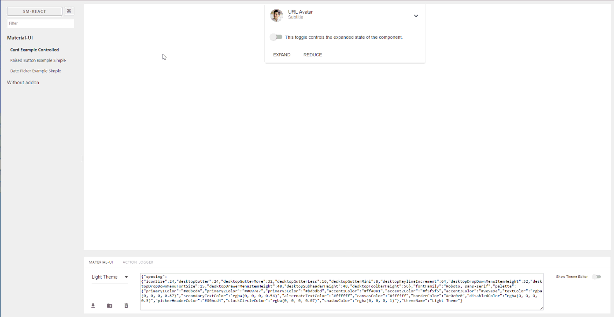

[](https://badge.fury.io/gh/sm-react%2Fstorybook-addon-material-ui)
[](https://badge.fury.io/js/storybook-addon-material-ui)

#  Storybook-Addon-Material-UI 
https://github.com/sm-react/storybook-addon-material-ui

### Visual theme editor
__You can use this project as [online](https://sm-react.github.io/storybook-addon-material-ui) theme editor to create new Material-UI themes__

Addon for [storybook](https://github.com/kadirahq/react-storybook) wich wrap [material-ui components](http://www.material-ui.com/) into MuiThemeProvider. This helps and simplifies [development](#getting-started) of material-ui based components.

[](https://raw.githubusercontent.com/sm-react/storybook-addon-material-ui/master/docs/WatchMe.gif)

## Features

- Wrapped in the theme provider. Just start to develop with base light theme.
- Injected TapEvent Plugin. Test on mobile devices.
- Switching themes. See how it looks in one click.
- Creating your custom theme. By code or in visual editor.
- Dynamic visual themes editing. Discover the all avalibale theme properties.
- Google [material color](https://material.google.com/style/color.html#color-color-palette) palette [picker](https://github.com/sm-react/react-material-color-picker)
- Save made changes and download in JSON file


## Demo
Explore this live demo project:

[](https://sm-react.github.io/storybook-addon-material-ui)

#### Example project
You can start with an example project:

```shell 
git clone -b example_project --single-branch https://github.com/sm-react/storybook-addon-material-ui.git
cd storybook-addon-material-ui\
npm i
npm start
```

## Getting Started

First, install the addon

```shell
npm i storybook-addon-material-ui --save-dev
```

Add this line to your addons.js file (create this file inside your storybook config directory if needed).

```js
import 'storybook-addon-material-ui';
```

Now, write your stories with material-ui addon. By default your stories will be provided with [`Light Base Theme`](https://github.com/callemall/material-ui/blob/master/src/styles/baseThemes/lightBaseTheme.js) and [`Dark Base Theme`](https://github.com/callemall/material-ui/blob/master/src/styles/baseThemes/darkBaseTheme.js)

```js
import React from 'react';
import { storiesOf, addDecorator } from '@kadira/storybook';
import {muiTheme} from 'storybook-addon-material-ui';

// Import some examples from material-ui
import CardExampleControlled from '../CardExampleControlled.jsx';
import RaisedButtonExampleSimple from '../RaisedButtonExampleSimple.jsx';
import DatePickerExampleSimple from '../DatePickerExampleSimple.jsx';

storiesOf('Material-UI', module)
// Add the `muiTheme` decorator to provide material-ui support to your stories.
// If you do not specify any arguments it starts with two default themes
// You can also configure `muiTheme` as a global decorator.
    .addDecorator(muiTheme())
    .add('Card Example Controlled', () => (
            <CardExampleControlled />
        ))
    .add('Raised Button Example Simple', () => (
            <RaisedButtonExampleSimple />
        ))
    .add('Date Picker Example Simple', () => (
            <DatePickerExampleSimple />
        ));
```
> Note : You can switch between the loaded themes. Out of the box, you have two base themes, but you can simply add your custom themes like this:

```js
import React from 'react';
import { storiesOf, addDecorator } from '@kadira/storybook';

import {muiTheme} from 'storybook-addon-material-ui';

import CardExampleControlled from '../CardExampleControlled.jsx';
import RaisedButtonExampleSimple from '../RaisedButtonExampleSimple.jsx';
import DatePickerExampleSimple from '../DatePickerExampleSimple.jsx';

// Create your own theme like this. 
// Note: you can specify theme name in `themeName` field. Otherwise it will be displayed by the number.
// you can specify only required fields overriding the `Light Base Theme`
const newTheme = {
    themeName: 'Grey Theme',
    palette: {
        primary1Color: '#00bcd4',
        alternateTextColor: '#4a4a4a',
        canvasColor: '#616161',
        textColor: '#bdbdbd',
        secondaryTextColor: 'rgba(255, 255, 255, 0.54)',
        disabledColor: '#757575',
        accent1Color: '#607d8b',
    },
};


storiesOf('Material-UI', module)
    .addDecorator(muiTheme([newTheme]))
    .add('Card Example Controlled', () => (
            <CardExampleControlled />
        ))
    .add('Raised Button Example Simple', () => (
            <RaisedButtonExampleSimple />
        ))
    .add('Date Picker Example Simple', () => (
            <DatePickerExampleSimple />
        ));


```

## Usage

Select `MATERIAL-UI` panel. You can select the theme you need to see and you will have all theme settings in the right sidebar. You can edit it manually or via picker tool (click the icon to the right of the input)


By default you see only assigned fields of selected theme. You can switch to `Full settings` and all available settings will appear. As you override one of them it will appear in `Theme setting`.


> See details in [sreenshorts](./docs/screenshorts.md)

After you have made changes in the theme, you can save it and download as *.JSON file.
>You can continue to work with this file:
```
import greyTheme from './greyTheme.json';
addDecorator(greyTheme);
```

## Query string parameters
As you select themes and other options it stores in adress bar line. So this state is retained when you refresh the page and you can use direct links to the desired states.
```
http://localhost:9001/?theme-ind=0&theme-sidebar=true&theme-full=true
```

## CONTRIBUTING 
[](./.eslintrc)
[](https://www.codetriage.com/sm-react/storybook-addon-material-ui)
### Developers:
Our team welcom all contributing, testing, bug fixing. If you would like
to help contribute to the project feel free to make an issue, PR or get in touch with me.

### Designers:
We would really welcome the involvement of designers in this project. We are very interested in your opinion about working with this tool, the possibility of joint work of the designer and developer as well as its appearance and capabilities

#### Credits
[](https://twitter.com/usulpro)
[](https://github.com/UsulPro)
[](https://github.com/sm-react)

#### Past Events

>## :jack_o_lantern: Check out our [Halloween Surprise](https://usulpro.github.io/SVG-theming/)

(now it's new [SVG-theming](https://github.com/UsulPro/SVG-theming) project)
